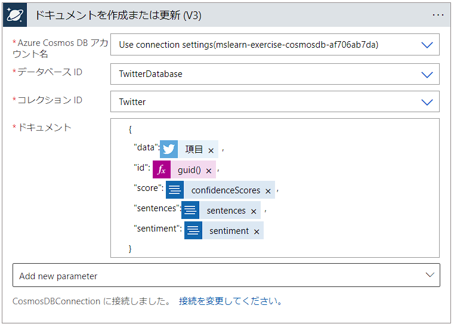

# 演習 - ソーシャル メディア トラッカー ロジック アプリを作成する

[< Previous Challenge](https://learn.microsoft.com/training/modules/route-and-process-data-logic-apps/3-detect-external-event-using-trigger) - **[Home](./README.md)** - [Next Challenge >](https://learn.microsoft.com/training/modules/route-and-process-data-logic-apps/5-execute-an-action)

この演習では、Azure portal を使用して、ソーシャル メディア ロジック アプリを作成します。 Logic Apps デザイナーを使用して Twitter トリガーを追加します。 次の図は、作業を行う部分が強調表示された、アプリの概念図を示しています。

# 全体像 
1. Azure ロジック アプリのリソースを見つける
1. Twitter トリガーを作成する
1. センチメントの検出アクションを作成する
1. CosmosDB アクションを作成する

# 1. Azure ロジック アプリのリソースを見つける
最初にするべきことは、Azure ロジック アプリを作成することです。 これを行うには、[Azure portal](https://portal.azure.com/) で Azure Logic Apps のリソースの種類を見つける必要があります。

1. [Azure portal](https://portal.azure.com/) にサインインします。
1. Azure portal のメニューで [リソースの作成] を選択し、上部の検索ボックスで [ロジック アプリ] と入力します。 [ロジック アプリ] ペインが表示されます。
1. ロジック アプリ画面で[作成] ボタンをクリックします。 [ロジック アプリの作成] ペインが表示されます。

## Azure ロジック アプリのリソースを構成する
リソース グループや場所などの基本的な設定を構成しましょう。

1. [基本] タブで、各設定に対して次の値を入力します。

    |  設定  |  値  |
    | ---- | ---- |
    |  **プロジェクトの詳細**  |
    |  サブスクリプション  |  ご自分のサブスクリプション  |
    |  リソース グループ   |  （新規）リソース グループ<br>　デフォルトでは、TrendTracker_group となります。  |
    |  **インスタンスの詳細**  |
    |  ロジック アプリ名  |  TrendTracker  |
    |  リージョン  |  最も近い場所をドロップダウン リストから選択します。  |
    |  プラン  |  消費  |

1. [確認と作成]、[作成] の順に選択します。 [デプロイ] ペインに、作成されたリソースが表示されます。 デプロイが正常に終了するまで待ちます。

## Azure ロジック アプリにテンプレートを使用する
Azure portal でロジック アプリを作成するときに、スターター テンプレートを選択することができます。 一からロジック アプリを構築できるように、空のテンプレートを選択してみましょう。

1. デプロイが完了したら、[リソースに移動] を選択します。 TrendTracker ロジック アプリの Logic Apps デザイナーが表示されます。
1. 下の [テンプレート] セクションまでスクロールして、[空のロジック アプリ] を選択します。

# 2. Twitter トリガーを作成する
では、トリガーを作成して、すべての必須パラメーターに値を指定してみましょう。

1. [コネクタとトリガーを検索] フィールドに `新しい Twitter が投稿されたら` と入力します。 下部のダイアログ ボックスで、Twitter の [新しいツイートが投稿されたら] を選択します。
1. [Twitter] ダイアログ ボックスでは、次の入力を求められます。

    > **注意**
    > 前の演習で既に接続情報を作成済みの場合は再利用してかまいません。

    |  設定  |  値  |
    | ---- | ---- |
    | [接続名] | TrendTrackerTwitterConnection |
    | [Authentication Type] | 既定値 (Use default shared application) をそのまま使用します |

1. [サインイン] をクリックします。 ご自分がお持ちの Twitter アカウントとパスワードを使用してサインインし、[連携アプリを認証] を選択します。 この操作により、Twitter アカウントへのログイン接続が確立されます。
1. Twetter の [新しいツイートが投稿されたら] ダイアログ ボックスが再び表示されれば、有効な接続が作成されています。 ダイアログ ボックスには、3 つの必須パラメーターがあります。

    |  設定  |  値  |
    | ---- | ---- |
    | 検索テキスト | XXX lang:ja exclude:retweets |
    |  | （調査したいキーワード） 日本語のみ、リツイート除外| 
    | 項目を確認する頻度 | 1 |
    | (頻度) | 分 |
    | Add new parameter | 既定値 (空白) をそのまま使用します。 |

1. コマンド バーの [保存] を選択します。

# 3. センチメントの検出アクションを見つける
続いてセンチメントの検出アクションを見つけます。

1. Twitter トリガーの下で、[新しいステップ] を選択します。
1. [コネクタとアクションを検索する] 検索ボックスに、 `センチメント` と入力します。
1. [**センチメント (V4)(プレビュー)**] コネクタを選択します。

## センチメントの検出アクションを作成する
センチメントの検出アクションが見つかったので、そのインスタンスを作成しましょう。 また、このプロセスでは、それを Text Analytics サブスクリプションに接続するように構成します。

> **注意**
> 前の演習で既に接続情報を作成済みの場合は再利用してかまいません。

1. [接続名] フィールドに、 `CognitiveServicesConnection` と入力します。
1. 保存した API キーを [アカウント キー] フィールドに、保存したエンドポイント アドレスを [サイトの URL] フィールドに貼り付けます。
1. ［作成］ を選択します

## センチメントの検出アクションを構成する
次に、ツイート テキストをセンチメントの検出アクションに渡すように、ロジック アプリを構成します。

1. [リソースのサブドメインや地域] ドロップダウンリストから、[Use connection settings(tweettextanalytics)] を選択します。
1. [documents id - 1] ボックスをクリックし、動的コンテンツのポップアップで、`ツイート ID` を選択します。
1. [documents text - 1] ボックスをクリックし、動的コンテンツのポップアップで、`ツイート テキスト` を選択します。
1. [documents language - 1] ボックスに `ja` と入力します。
1. コマンド バーの [保存] を選択します。

# 4. Cosmos DB ドキュメントの作成アクションを見つける
Twitter から得られるデータはツイートテキストだけではありません。投稿者プロファイル、メディア URL、リツイート情報などが得られます。
高度で継続的な Twitter データ分析のために、取得した Twitter のデータはすべてデータベースに格納したいと思います。

アクションを追加する前に、Cosmos DB アカウントの作成とコレクションの作成を完了しておきます。

## Cosmos DB データベースを作成する
ツイートを受信したときに、それをバックエンド データベースに保存します。

1. [Azure portal](https://portal.azure.com/) にサインインします。
1. 右上の Cloud Shell で、次の curl コマンドを実行して、GitHub から setup-sql-cosmosdb.sh スクリプトをコピーします。

    ```bash
    curl https://raw.githubusercontent.com/nohanaga/app-analytics-ai-students/main/scripts/setup-sql-cosmosdb.sh> setup-sql-cosmosdb.sh
    ```

1. 次のコマンドを実行して、スクリプトを実行します。**[Resource Group]** の部分を既存のリソースグループ名で置き換えます。 このコマンドは数分かかります。

    ```bash
    bash setup-sql-cosmosdb.sh [Resource Group]
    ```

1. スクリプトが完了するのを待ちます。 完了すると、Cloud Shell には、次のプロパティの値が表示されます。

    - Cosmos DB アカウント ID
    - Cosmos DB データベース名
    - Cosmos DB コンテナー名
    - Cosmos DB アクセスキー

    Cloud Shell に表示される値を安全な場所に保存します。 これらは、この演習で、Azure portal でアプリを更新するときに必要です。

## Cosmos DB の行の挿入アクションを見つける
1. センチメント(V4) アクションの下で、[アクションの追加] を選択します。
1. [コネクタとアクションを検索する] フィールドに、 `Cosmos DB` と入力します。
1. Cosmos DB コネクタを選択します。
1. [ドキュメントを作成または更新 (V3)] を選択します。

## Cosmos DB の行の挿入アクションを作成する
Cosmos DB アクションが見つかったので、それを作成してみましょう。 作成時に、Cosmos DB データベース名とログイン資格情報も提供します。

1. [接続名] フィールドに、 `CosmosDBConnection` と入力します。
1. [Authentication type] ドロップダウンで `Access Key` を選択します。
1. [Account ID] フィールドに、スクリプトから出力された `Account ID` を入力します。
1. [Access Key to your Azure Cosmos DB account] に、スクリプトから出力された `Access Key` を入力します。
1. [作成] を選択します

## Cosmos DB の行の挿入アクションを構成する
Cosmos DB アクションが作成されましたが、ツイート データをデータベースの列にマップする方法を指定する必要があります。

1. [Azure Cosmos DB アカウント名] に、「Use connection settings (Cosmos DB アカウント ID)」を選択します。
1. [データベース ID] に `TwitterDatabase` を選択します。
1. [コレクション ID] ドロップダウン リストからコレクション `Twitter` を選択します。
1. [ドキュメント] ボックスに下記をコピーして貼り付けます。

    ```
    {
      "data": ,
      "id": @{guid()},
      "score": ,
      "sentences": ,
      "sentiment": 
    }
    ```
    
1. 下記画像と同じになるように動的コンテンツのポップアップから項目を選択します。

    

1. [保存] を選択します。