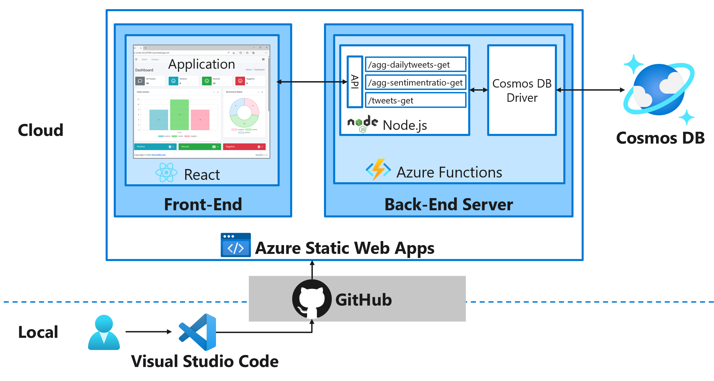

# 演習 - Azure Static Web Apps で Twitter 分析 Web アプリをデプロイする

**[Home](./README.md)** 

この演習では、ツイートデータの分析結果を提供する React Web アプリケーションを Azure Static Web Apps と Azure Functions を使用して発行します。 コードは GitHub から Azure Static Web Apps へデプロイされます。

# 全体像 
1. React を使用して既存の Web アプリ プロジェクトを選択する
1. ローカルでアプリケーションを実行する
1. アプリとその API を Static Web Apps CLI を使用して Azure Static Web Apps に発行する



## リポジトリを取得する

まず、サンプルのシングル ページ アプリケーションのソースコード一式が含まれたリポジトリのコンテンツを取得します。コンテンツは GitHub にて公開されており、下記リンクから zip ファイルとして取得できます。

https://github.com/nohanaga/static-web-app-and-api-demo/archive/refs/heads/main.zip

参加者の環境により上記のリンクにアクセスできない場合、講師等が上記のリンクより zip ファイルを取得し、参加者と共有してください。

## アプリをローカルで実行する
これで、ローカル コンピュータ上にサンプルのシングル ページ アプリケーションのソースコード一式を保存できました。次に zip ファイルを解凍して、使用しているコンピューター上でローカルにコードを実行します。

  1. ダウンロードした zip ファイルを任意の場所で解凍します。
  1. コンピューター上でターミナル ウィンドウを開きます。  
     Windows を使用している場合、システム トレイの検索ボックスに「`cmd`」と入力できます。
  1. 手順 1. で zip ファイルを解凍したディレクトリに変更します。  

     ```bash
     cd mslearn-staticwebapp-api-main
     ```

     ディレクトリを変更した後は下記のファイル / ディレクトリ構成になります。

     ```
     static-web-app-and-api-demo-main
     ├─.devcontainer/
     ├─.vscode/
     ├─api/
     ├─react-app/
     ├─.gitignore
     ├─CODE_OF_CONDUCT.md
     ├─LICENSE
     ├─LICENSE-CODE
     ├─README.md
     └─SECURITY.md
     ```

## アプリケーション フォルダーを開く
1. Visual Studio Code を起動します。
1. <kbd>F1</kbd> キーを選択して、Visual Studio Code コマンド パレットを開きます。
1. 「File: Open Folder...」と入力します。
1. `twitter-analytics-app` フォルダーを選択します。
1. [開く] を選択して、Visual Studio Code でフォルダーを開きます。
1. 複製したソース コードのディレクトリに変更します。

    ```bash
    cd twitter-analytics-app
    ```

1. React フロントエンド フレームワークのディレクトリに移動します。

    ```bash
    cd react-app
    ```

1. 次のコマンドを使用して、Node.js バージョン `v16.14.2` 、および npm バージョン `8.5.0` がインストールされていることを確認します。

    ```bash
    node -v
    ```

    ```bash
    npm -v
    ```

    > **注意**
    > Node.js バージョン `v16.14.2` 、および npm バージョン `8.5.0` がインストールされていない場合は、[こちら](https://nodejs.org/en/blog/release/v16.14.2/)などを参照してインストールしてください。
    > ローカル PC に Node.js をインストールするのが難しい場合、ローカルでのアプリ実行はスキップすることができます。

1. アプリケーションの依存関係をインストールします。

    ```bash
    npm install
    ```

1. フロントエンド クライアント アプリケーションを実行します。

    ```bash
    npm start
    ```

## アプリに移動する
アプリケーション バンドルが生成されてコンパイルされると、ブラウザー タブが自動的に開き、アプリケーションがローカルで実行されていることが表示されます。

React のローカル ホストは `http://localhost:3000` です。


このプロジェクトには既に API が含まれていますが、Functions が起動しておらず、データベースへの接続情報がまだないためアプリには数値やグラフが表示されません。データベースへの接続情報をコードに埋め込むのはセキュリティ上の問題がありますので、ローカル開発・リモート開発それぞれで環境変数を追加することによって接続を行います。

## ローカル環境で環境変数を追加する
1. `api/local.settings.json` という名前のファイルを作成します。
1. そのファイルに次の内容を追加します。`COSMOSDB_CONNECTIONSTRING` には Cosmos DB の接続文字列を貼り付けます。

```json
{
  "IsEncrypted": false,
  "Values": {
    "AzureWebJobsStorage": "",
    "FUNCTIONS_WORKER_RUNTIME": "node",
    "COSMOSDB_CONNECTIONSTRING": "AccountEndpoint=https://[Account ID].documents.azure.com:443/;AccountKey=xxx;",
    "COSMOSDB_SQL_API_DATABASE_NAME": "TwitterDatabase",
    "COSMOSDB_SQL_API_CONTAINER_NAME": "Twitter"
  }
}
```

## API を実行する

> **注意**
> Azure Functions をローカルで実行できるように、Azure Functions Core Tools を必ずインストールしてください。

1. Visual Studio Code で、<kbd>F1</kbd> キーを押してコマンド パレットを開きます。
1. 「(アクティブなワークスペースで) Terminal: Create New Terminal」と入力して選択します。
1. `api` フォルダーに移動します。

    ```bash
    cd api
    ```

1. API の依存関係をインストールします。

    ```bash
    npm install
    ```

1. Azure Functions アプリをローカルで実行します。

    ```bash
    func start
    ```

    これでポート 3000 に React フロントエンドが、ポート 7071 で API バックエンドが起動している状態になります。終了するには各ターミナルで、<kbd>Ctrl</kbd>+<kbd>C</kbd> キーを押してバッチ ジョブを停止します。

おめでとうございます。 アプリケーションをビルドし、ローカルに実行されていることをブラウザーで確認しました。 これで、アプリケーションを Azure Static Web Apps に発行できます。

## 静的 Web アプリを作成する
次に Azure Static Web Apps を作成します。 これを行うには、[Azure portal](https://portal.azure.com/) で Azure Static Web Apps のリソースの種類を見つける必要があります。

1. [Azure portal](https://portal.azure.com/) にサインインします。
1. Azure portal のメニューで [リソースの作成] を選択し、上部の検索ボックスで [静的 Web アプリ] と入力します。 [静的 Web アプリ] ペインが表示されます。
1. 静的 Web アプリ画面で[作成] ボタンをクリックします。 [静的 Web アプリの作成] ペインが表示されます。

## 静的 Web アプリの作成
リソース グループや場所などの基本的な設定を構成しましょう。

1. [基本] タブで、各設定に対して次の値を入力します。

    |  設定  |  値  |
    | ---- | ---- |
    |  **プロジェクトの詳細**  |
    |  サブスクリプション  |  ご自分のサブスクリプション  |
    |  リソース グループ   |  任意のリソース グループ<br>　新規作成 or これまで使ってきたリソース グループでも構いません。  |
    |  **静的 Web アプリの詳細**  |
    |  静的 Web アプリ名  |  twitter-analytics-app  |
    |  プランの種類  |  Free  |
    |  **Azure Functions とステージングの詳細**  |
    |  Azure Functions API とステージング環境のリージョン  |  最も近い場所をドロップダウン リストから選択します。<br>　ex. East Asia  |
    |  **デプロイの詳細**  |
    |  ソース  |  その他  |

1. [確認および作成]、[作成] の順に選択します。 [デプロイ] ペインに、作成されたリソースが表示されます。 デプロイが正常に終了するまで待ちます。

1. デプロイが正常に終了したら、デプロイした静的 Web アプリ リソースに移動した後、[概要] 上部の [デプロイ トークンの管理] をクリックし、デプロイ トークンをコピーし控えます。このデプロイ トークンは静的 Web アプリへのシングル ページ アプリケーションの展開に使用します。

1. ブラウザから Azure portal の Static Web Apps ページが開きます。左メニューから [設定] セクションの [構成] を選択します。右側の [アプリケーション設定] タブから下記の環境変数を追加して [保存] します。

    |  名前  |  値  |
    | ---- | ---- |
    |  COSMOSDB_CONNECTIONSTRING  |  Cosmos DB スクリプト実行時に保存した接続文字列  |
    |    |  接続文字列は `AccountEndpoint=https://[Account ID].documents.azure.com:443/;AccountKey=xxx;` のような形式です  |
    |  COSMOSDB_SQL_API_DATABASE_NAME  |  `TwitterDatabase`  |
    |  COSMOSDB_SQL_API_CONTAINER_NAME  |  `Twitter`  |

## 静的 Web アプリへのアプリケーション、および、API の展開
SWA CLI を使用したデプロイを行います。デプロイが正常に完了したら、実行中のアプリをブラウザーで表示できます。

  1. 静的 Web アプリに `react-app/build` 内のコンテンツ、および `api` 内の関数コードを展開します。

     ```bash
     npx --package @azure/static-web-apps-cli swa deploy react-app/build --env Production --swa-config-location react-app --deployment-token <デプロイ トークン> --api-location ./api
     ```

  1. コマンドが正常に終了すると、`√ Project deployed to <サイトの URL> 🚀` というメッセージが表示されるので、ブラウザーのアドレス バーに URL を入力して、展開したシングル ページ アプリケーションを表示します。  

おめでとうございます。 アプリを Azure Static Web Apps にデプロイしました。


> **注意**
> アプリがまだビルドおよびデプロイされていないことを示す Web ページが表示されても心配しないでください。 しばらくしてからブラウザーを再更新してみてください。 Azure 静的 Web アプリが作成されると、GitHub アクションによって自動的に実行されます。 そのため、スプラッシュ ページが表示されても、アプリはデプロイ中です。

----

**[Home](./README.md)** 
