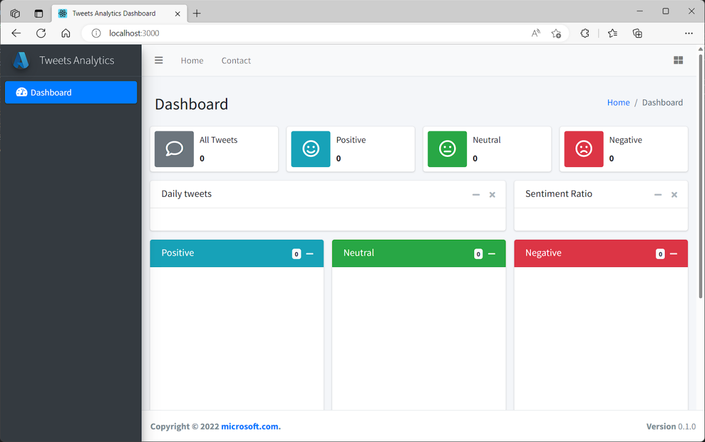
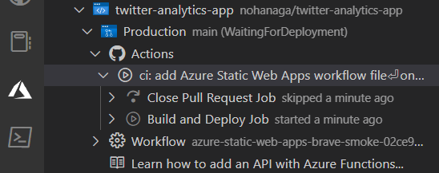
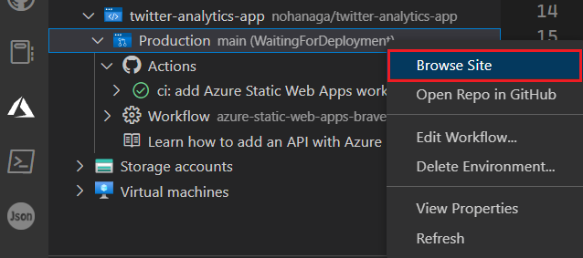

# 演習 - Azure Static Web Apps で Twitter 分析 Web アプリをデプロイする

[< Previous Challenge](./4-1-ex-create-social-media-tracker.md) - **[Home](./README.md)** 

この演習では、ツイートデータの分析結果を提供する React Web アプリケーションを Azure Static Web Apps と Azure Functions を使用して発行します。 プレビュー URL を使用して、GitHub からステージング サイトにコードをデプロイします。

# 全体像 
1. React を使用して既存の Web アプリ プロジェクトを選択する
1. Azure Functions を使用してアプリの API を作成する
1. ローカルでアプリケーションを実行する
1. アプリを Azure Static Web Apps に発行する
1. アプリとその API を Azure Static Web Apps に発行し、ステージング サイトに発行する

## リポジトリを作成する
まず、GitHub テンプレートを使用してリポジトリを作成します。 一連のリポジトリ テンプレートを使用できます。これには、さまざまなフロントエンド フレームワークに実装されたスターター アプリが含まれています。

1. GitHub の[テンプレートからの作成ページ](https://github.com/nohanaga/static-web-app-and-api-demo)に移動し、テンプレート リポジトリを開きます。
1. 緑色の [Use this template] ボタンをクリックし、\[Create a new repository](テンプレートからリポジトリを作成する) を選択します。
1. Owner(所有者)の入力を求められた場合は、GitHub アカウントのいずれかを選択します。
1. リポジトリ名として「twitter-analytics-app」を入力します。
1. [Create repository from template] ボタンをクリックすると、GitHub によってバックグラウンドでリポジトリが構築されます。

## アプリをローカルで実行する
これで、GitHub アカウントに twitter-analytics-app という名前の GitHub リポジトリが作成されました。 次に、GitHub リポジトリをクローンし、使用しているコンピューター上でローカルにコードを実行します。

1. コンピューター上でターミナル ウィンドウを開きます。

    Windows を使用している場合、システム トレイの検索ボックスに「cmd」と入力できます。

1. リポジトリを自分のマシンに複製するには、次のコードをコマンド プロンプト ウィンドウに貼り付けます。

    `<YOUR_GITHUB_USERNAME>` は、必ずお使いの GitHub ユーザー名に置き換えてください。

    ```bash
    git clone https://github.com/<YOUR_GITHUB_USERNAME>/twitter-analytics-app
    ```

    > **注意**
    > コマンド プロンプト ターミナルへのコピーで問題が発生した場合は、タイトル バーのアイコンを右クリックし、[プロパティ] タブで、[Use Ctrl+Shift+C/V as Copy/Paste](コピー/貼り付けとして Ctrl + Shift + C/V を使用する) がオンになっていることを確認します。

1. 複製したソース コードのディレクトリに変更します。

    ```bash
    cd twitter-analytics-app
    ```

1. React フロントエンド フレームワークのディレクトリに移動します。

    ```bash
    cd react-app
    ```

1. アプリケーションの依存関係をインストールします。

    ```bash
    npm install
    ```

1. 次のコマンドを使用して、Node.js バージョン `v16.14.2` がインストールされていることを確認します。

    ```bash
    node -v
    ```

    > **注意**
    > Node.js バージョン `v16.14.2` がインストールされていない場合は、こちらなどを参照してインストールしてください。
    > ローカル PC に Node.js をインストールするのが難しい場合、ローカルでのアプリ実行はスキップすることができます。

1. フロントエンド クライアント アプリケーションを実行します。

    ```bash
    npm start
    ```

## アプリに移動する
アプリケーション バンドルが生成されてコンパイルされると、ブラウザー タブが自動的に開き、アプリケーションがローカルで実行されていることが表示されます。

React のローカル ホストは `http://localhost:3000` です。



データや API がまだないため、アプリには数値やグラフが表示されません。 このレッスンでは、後で Web アプリ用の API を追加します。

ターミナルで、<kbd>Ctrl</kbd>+<kbd>C</kbd> キーを押してバッチ ジョブを停止します。

おめでとうございます。 アプリケーションをビルドし、ローカルに実行されていることをブラウザーで確認しました。 これで、アプリケーションを Azure Static Web Apps に発行できます。

## Static Web Apps を作成する
独自の GitHub リポジトリを作成したので、Visual Studio Code 用の Azure Static Web Apps 拡張機能を使用して、独自の Static Web Apps を作成できます。

### Visual Studio Code 用の Azure Static Web Apps 拡張機能をインストールする

> **注意**
> Visual Studio Code 用の Azure Static Web Apps 拡張機能 を既にインストールされている方はスキップしてください。

1. Visual Studio Code を開きます。
1. 上部のメニューから [表示]>[拡張機能] の順に選択し、検索ボックスに「Azure Static Web Apps」と入力します。
1. 拡張機能タブが Visual Studio Code に読み込まれたら、[インストール] を選択します。

## アプリケーション フォルダーを開く
1. <kbd>F1</kbd> キーを選択して、Visual Studio Code コマンド パレットを開きます。
1. 「File: Open Folder...」と入力します。
1. `twitter-analytics-app` フォルダーを選択します。
1. [開く] を選択して、Visual Studio Code でフォルダーを開きます。

## Static Web Apps の作成
静的 Web アプリを作成するには、現在 Azure および GitHub で認証されているセッションが必要です。 両方のプロバイダーにまだサインインしていない場合は、作成プロセス中に、拡張機能により、サインインするように求められます。

1. <kbd>F1</kbd> キーを選択して、Visual Studio Code コマンド パレットを開きます。
1. 「Azure Static Web Apps: Create Static Web App...」と入力して選択します。

    コマンド パレット プロンプトの残りの部分に次の値を入力します。

    |  Prompt  |  値  |
    | ---- | ---- |
    |  名前  |  **`twitter-analytics-app`** と入力します  |
    |  リージョン  |  最も近いリージョンを選択します  |
    |  プリセット  |  **React** を選択します  |
    |  アプリケーション コードの場所  |  **`react-app`** と入力します  |
    |  Output location (出力場所)  |  **`build`** と入力します  |
    
1. アプリが作成されると、確認通知が Visual Studio Code に表示されます。ビルドの構成中、Visual Studio Code にビルドの状態が示されます。
1. GitHub Actions で [Actions] メニューを展開すると、デプロイの進行状況を参照できます。

    

    デプロイが完了したら、Web サイトに直接移動できます。

1. ブラウザーで Web サイトを表示するには、Static Web Apps 拡張機能でプロジェクトを右クリックし、 \[Browse Site](サイトの参照) を選択します。

    

おめでとうございます。 アプリを Azure Static Web Apps にデプロイしました。


> **注意**
> アプリがまだビルドおよびデプロイされていないことを示す Web ページが表示されても心配しないでください。 しばらくしてからブラウザーを再更新してみてください。 Azure 静的 Web アプリが作成されると、GitHub アクションによって自動的に実行されます。 そのため、スプラッシュ ページが表示されても、アプリはデプロイ中です。