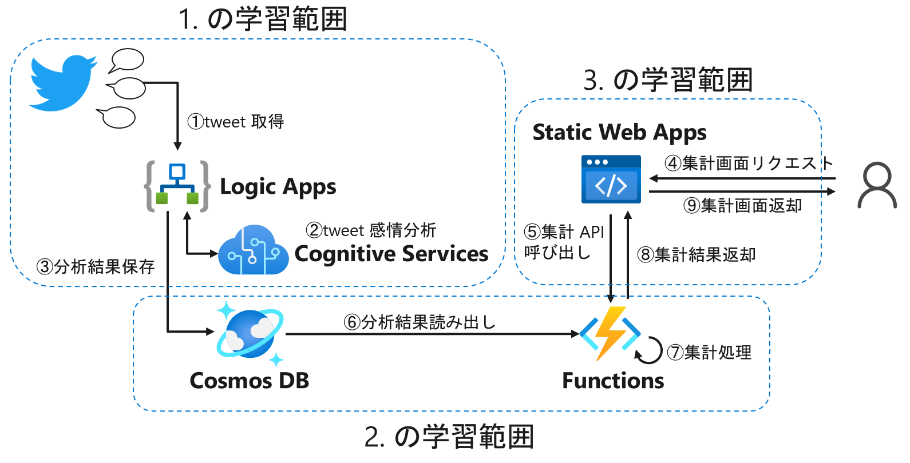

# Azure Basic Hands-on トレーニング 

## Introduction
このトレーニングでは、AI 搭載のクラウドネイティブ Web アプリケーションを迅速に構築する方法を学ぶことができます。Azure を使うのが初めての方、Web アプリケーションの基本的な仕組みや開発手法を知りたい方、アプリケーションと AI の組み合わせ方法を知りたい方におすすめです。

まず Twitter のようなソーシャルデータを自動的に取得し、AI によるテキスト感情分析を行ってデータベースに保存するワークフローを作成します。データベースに保存したデータは集計などを行いながら、モダン Web フレームワークである React を用いてブラウザで可視化します。

このトレーニングでは、以下のサービスを利用します。

- Azure Logic Apps
- Azure Cognitive Services
- Azure SQL Database
- Azure Cosmos DB
- Azure Functions
- Azure Static Web Apps
- GitHub
- Twitter

## Architecture

## Goal
このモジュールでは、次のことを行います。
### 1. Logic Apps で感情分析アプリ開発
- ビジネスの問題を解決するためのワークフロー モデルを構築する
- 外部イベントに応答し、Logic Apps を起動する
- 処理条件付きロジックを適用して、データをフィルターし、処理パスを選択する
- Azure サービスをワークフローに統合する

### 2. Functions から NoSQL Database にデータ投入
- Azure の NoSQL である Cosmos DB について基礎を理解する
- Visual Studio Code を使用して Azure に JavaScript 関数を作成する
- Visual Studio Code を使用して Azure Functions を Azure Cosmos DB に接続する

### 3. Static Web Apps で SPA 開発
- Angular、React、Svelte、または Vue を使用して既存の Web アプリ プロジェクトを選択する
- Azure Functions を使用してアプリの API を作成する
- ローカルでアプリケーションを実行する
- アプリを Azure Static Web Apps に発行する
- アプリとその API を Azure Static Web Apps に発行し、ステージング サイトに発行する

## 前提条件
 - 初心者レベルでの Azure portal を使用するリソースの作成および管理経験
 - コネクタ、トリガー、およびアクションの Azure Logic Apps の概念の基本的な知識
 - 条件付きステートメントやループなどのプログラミングの概念に関する知識

## Contents
### 1. Logic Apps で感情分析アプリ開発
組み込みのトリガー、アクション、および条件演算子を使用してワークフローを定義します。 ワークフローはデータがあるときに自動的に実行され、クラウド内のデータを処理し、データベースで結果を記録し、電子メール通知を送信します。

 - Challenge-01 [はじめに](https://learn.microsoft.com/training/modules/route-and-process-data-logic-apps/1-introduction)
 - Challenge-02 [ワークフロー用に Logic Apps を設計する](https://learn.microsoft.com/training/modules/route-and-process-data-logic-apps/2-design-logic-apps-for-your-workflows)
 - Challenge-03 [トリガーを使用して外部イベントを検出する](https://learn.microsoft.com/training/modules/route-and-process-data-logic-apps/3-detect-external-event-using-trigger)
 - Challenge-04 [演習 - ソーシャル メディア トラッカー ロジック アプリを作成する](./1-4-ex-create-social-media-tracker.md)
 - Challenge-05 [アクションを実行する](https://learn.microsoft.com/training/modules/route-and-process-data-logic-apps/5-execute-an-action)
 - Challenge-06 [演習 - ツイートのコンテンツを分析する](./1-6-ex-analyze-content-of-tweet.md)
 - Challenge-07 [コントロール アクションを使用して制御フローを変更する](https://learn.microsoft.com/training/modules/route-and-process-data-logic-apps/7-alter-control-flow-using-control-action)
 - Challenge-08 [演習 - ツイートの感情に基づいて分岐する](./1-8-ex-branch-based-on-tweet-sentiment.md)
 - Challenge-09 [まとめ](https://learn.microsoft.com/training/modules/route-and-process-data-logic-apps/9-summary)

### 2. Functions から NoSQL Database にデータ投入
Azure の NoSQL である Cosmos DB とはどのようなデータストアなのかを理解し、そのうえで Azure Function から実際にデータを投入、参照してみます。

 - Challenge-01 [Azure Functions の概要](https://learn.microsoft.com/azure/azure-functions/functions-overview)
 - Challenge-02 [Azure Cosmos DB を使用するソリューションを開発する](https://learn.microsoft.com/ja-jp/training/paths/az-204-develop-solutions-that-use-azure-cosmos-db/)
 - Challenge-03 [演習 - Visual Studio Code を使用して Azure に JavaScript 関数を作成する](https://learn.microsoft.com/azure/azure-functions/create-first-function-vs-code-node)
 - Challenge-04 [演習 - Visual Studio Code を使用して Azure Functions を Azure Cosmos DB に接続する](https://learn.microsoft.com/azure/azure-functions/functions-add-output-binding-cosmos-db-vs-code?pivots=programming-language-javascript&tabs=in-process)

### 3. Static Web Apps で SPA 開発
Azure Static Web Apps と Azure Functions を使用して、React の JavaScript アプリと API を発行します。 プレビュー URL を使用して、GitHub からステージング サイトにコードをデプロイします。

 - Challenge-01 [はじめに](https://learn.microsoft.com/training/modules/publish-static-web-app-api-preview-url/1-introduction?pivots=react)
 - Challenge-02 [GitHub とは](https://learn.microsoft.com/training/modules/introduction-to-github/2-what-is-github)
 - Challenge-03 [演習 - はじめに](./3-2-exercise-get-started.md)
 - Challenge-04 [Azure Functions を使用して API をビルドする](https://learn.microsoft.com/training/modules/publish-static-web-app-api-preview-url/3-build-api)
 - Challenge-05 [演習 - Azure Functions プロジェクトを作成する](./3-4-exercise-function-app.md)
 - Challenge-06 [GitHub Actions を使用して API を発行する](https://learn.microsoft.com/training/modules/publish-static-web-app-api-preview-url/5-action?pivots=react)
 - Challenge-07 [演習 - GitHub Actions を使用して API を発行する](./3-6-exercise-action.md)
 - Challenge-08 [知識チェック](https://learn.microsoft.com/training/modules/publish-static-web-app-api-preview-url/7-knowledge-check)
 - Challenge-09 [まとめ](https://learn.microsoft.com/training/modules/publish-static-web-app-api-preview-url/8-summary)

### 4. 応用: クラウドネイティブアプリを体感する
これまでに身に着けた知識を総動員して、クラウドネイティブで AI を搭載した Web アプリケーションを開発します。

 - Challenge-01 [Twitter トレンド トラッカー ロジック アプリを作成する](./4-1-ex-create-social-media-tracker.md)
 - Challenge-02 [Azure Static Web Apps で Twitter 分析 Web アプリをデプロイする](./4-2-ex-deploy-static-web-app-api.md)

 

## 学習コンテンツ ラーニングパス

  

    こちらをクリック
  

  

[Azure 上のクラウドネイティブ アプリの概要](https://learn.microsoft.com/training/modules/introduction-to-cloud-native-apps/)

#### Azure Logic Apps
- [Azure Logic Apps でデータとアプリを統合するための自動化されたワークフローを構築する](https://learn.microsoft.com/training/paths/build-workflows-with-logic-apps/)

#### Azure Cognitive Services
- [AI エンジニアリングへの準備](https://learn.microsoft.com/training/paths/prepare-for-ai-engineering/)
- [言語サービスを使用してテキストから分析情報を抽出する](https://learn.microsoft.com/training/modules/extract-insights-text-with-text-analytics-service/)

#### Azure Functions
- [Azure Functions を実装する](https://learn.microsoft.com/training/paths/implement-azure-functions/)

#### Azure Cosmos DB
- [Azure Cosmos DB の基礎を調べる](https://learn.microsoft.com/training/modules/explore-non-relational-data-stores-azure/)
- [Azure でのデータ プラットフォームの設計](https://learn.microsoft.com/training/paths/architect-data-platform/)

#### Azure Static Web Apps
- [Azure Static Web Apps ラーニングパス](https://learn.microsoft.com/training/paths/azure-static-web-apps/)

#### GitHub
- [Git プロジェクトを作成および変更する方法](https://learn.microsoft.com/training/modules/create-git-project/)
- [GitHub Actions を使用してワークフローを自動化する](https://learn.microsoft.com/training/paths/automate-workflow-github-actions/)

  

 

## LICENSE
このドキュメントに記載されている情報 (URL や他のインターネット Web サイト参照を含む) は、将来予告なしに変更することがあります。別途記載されていない場合、このソフトウェアおよび関連するドキュメントで使用している会社、組織、製品、ドメイン名、電子メール アドレス、ロゴ、人物、場所、出来事などの名称は架空のものです。実在する商品名、団体名、個人名などとは一切関係ありません。お客様ご自身の責任において、適用されるすべての著作権関連法規に従ったご使用をお願いいたします。著作権法による制限に関係なく、マイクロソフトの書面による許可なしに、このドキュメントの一部または全部を複製したり、検索システムに保存または登録したり、別の形式に変換したりすることは、手段、目的を問わず禁じられています。ここでいう手段とは、複写や記録など、電子的、または物理的なすべての手段を含みます。

マイクロソフトは、このドキュメントに記載されている内容に関し、特許、特許申請、商標、著作権、またはその他の無体財産権を有する場合があります。別途マイクロソフトのライセンス契約上に明示の規定のない限り、このドキュメントはこれらの特許、商標、著作権、またはその他の知的財産権に関する権利をお客様に許諾するものではありません。

製造元名、製品名、URL は、情報提供のみを目的としており、これらの製造元またはマイクロソフトのテクノロジを搭載した製品の使用について、マイクロソフトは、明示的、黙示的、または法令によるいかなる表明も保証もいたしません。製造元または製品に対する言及は、マイクロソフトが当該製造元または製品を推奨していることを示唆するものではありません。掲載されているリンクは、外部サイトへのものである場合があります。これらのサイトはマイクロソフトの管理下にあるものではなく、リンク先のサイトのコンテンツ、リンク先のサイトに含まれているリンク、または当該サイトの変更や更新について、マイクロソフトは一切責任を負いません。リンク先のサイトから受信した Web キャストまたはその他の形式での通信について、マイクロソフトは責任を負いません。マイクロソフトは受講者の便宜を図る目的でのみ、これらのリンクを提供します。また、リンクの掲載は、マイクロソフトが当該サイトまたは当該サイトに掲載されている製品を推奨していることを示唆するものではありません。

Copyright (c) Microsoft Corporation. All rights reserved.
